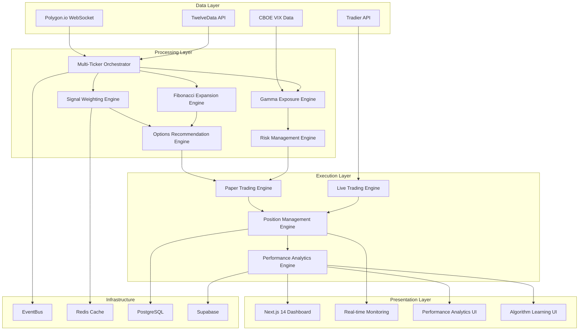
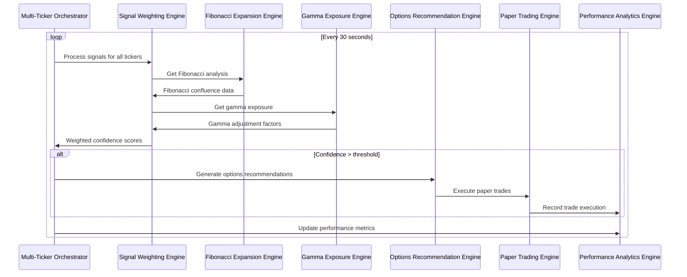
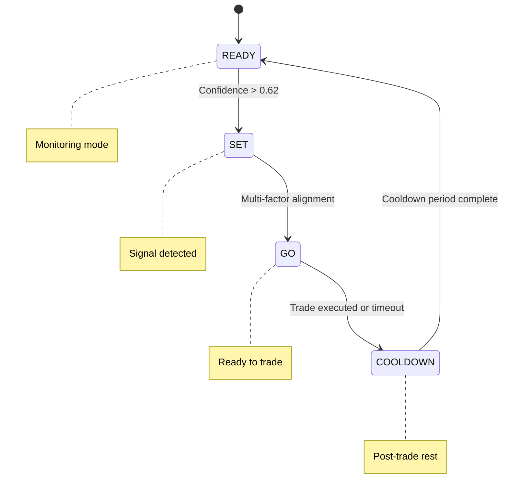

# Design Document

## Overview

The Gamma Adaptive Trading System v3.0 is architected as a comprehensive production trading system that orchestrates multiple assets simultaneously while providing advanced signal processing, smart options trading, and machine learning capabilities. The system follows a microservices architecture with real-time data processing, event-driven communication, and scalable deployment patterns. The design emphasizes performance, reliability, and extensibility to support institutional-grade trading operations.

## Architecture

### System Architecture Overview



### Multi-Ticker Orchestration Flow



### Ready-Set-Go State Management



## Components and Interfaces

### Core Orchestration Components

#### Multi-Ticker Orchestrator
```typescript
export interface TickerState {
  ticker: string;
  status: 'READY' | 'SET' | 'GO' | 'COOLDOWN';
  confidence: number;
  conviction: number;
  fibZone: FibZone;
  gammaExposure: number;
  recommendedOption?: OptionRecommendation;
  position?: PaperPosition;
  lastUpdate: Date;
  stateEntryTime: Date;
  cooldownUntil?: Date;
}

export interface MultiTickerConfig {
  watchlist: string[];
  maxConcurrentTrades: number;
  confidenceThreshold: number;
  fibZoneBlocklist: FibZone[];
  updateInterval: number;
  priorityWeights: Record<string, number>;
}

export class MultiTickerOrchestrator {
  private tickerStates: Map<string, TickerState> = new Map();
  private activeWorkers: Map<string, Worker> = new Map();
  
  public async start(): Promise<void>;
  public async stop(): Promise<void>;
  public async addTicker(ticker: string): Promise<void>;
  public async removeTicker(ticker: string): Promise<void>;
  public getTickerState(ticker: string): TickerState | null;
  public getAllTickerStates(): TickerState[];
  public getActivePositions(): PaperPosition[];
  
  private async processTickerSignals(): Promise<void>;
  private async updateTickerState(ticker: string, newState: Partial<TickerState>): Promise<void>;
  private async handleStateTransition(ticker: string, fromState: string, toState: string): Promise<void>;
  private canExecuteTrade(): boolean;
  private prioritizeTickers(tickers: TickerState[]): TickerState[];
}
```

#### Signal Weighting Engine
```typescript
export interface SignalFactors {
  ticker: string;
  trendComposite: number;
  momentumDivergence: number;
  volumeProfile: number;
  ribbonAlignment: number;
  fibConfluence: number;
  gammaExposure: number;
  timestamp: Date;
}

export interface ConfidenceResult {
  confidence: number;
  conviction: number;
  factors: SignalFactors;
  breakdown: {
    trendWeight: number;
    momentumWeight: number;
    volumeWeight: number;
    ribbonWeight: number;
    fibWeight: number;
    gammaWeight: number;
  };
}

export class SignalWeightingEngine {
  private readonly WEIGHTS = {
    trendComposite: 0.25,
    momentumDivergence: 0.20,
    volumeProfile: 0.20,
    ribbonAlignment: 0.15,
    fibConfluence: 0.10,
    gammaExposure: 0.10
  };
  
  public computeEnhancedConfidence(factors: SignalFactors): ConfidenceResult;
  public calculateTrendComposite(ticker: string): Promise<number>;
  public analyzeMomentumDivergence(ticker: string): Promise<number>;
  public assessVolumeProfile(ticker: string): Promise<number>;
  public measureRibbonAlignment(ticker: string): Promise<number>;
  
  private normalizeFactors(factors: SignalFactors): SignalFactors;
  private applyRegimeAdjustment(confidence: number, regime: string): number;
  private calculateConviction(confidence: number): number;
}
```

### Advanced Analysis Engines

#### Fibonacci Expansion Engine
```typescript
export type FibZone = 'COMPRESSION' | 'MID_EXPANSION' | 'FULL_EXPANSION' | 'OVER_EXTENSION' | 'EXHAUSTION';

export interface FibonacciAnalysis {
  currentZone: FibZone;
  expansionLevel: number;
  keyLevels: {
    support: number[];
    resistance: number[];
    targets: number[];
  };
  confluence: number;
  zoneMultiplier: number;
  riskAdjustment: number;
}

export class FibExpansionEngine {
  public analyzeExpansion(ticker: string, timeframe: string): Promise<FibonacciAnalysis>;
  public calculateZoneMultiplier(zone: FibZone): number;
  public identifyKeyLevels(ticker: string, lookbackPeriod: number): Promise<FibLevel[]>;
  public assessConfluence(price: number, levels: FibLevel[]): number;
  
  private calculateExpansionLevel(high: number, low: number, current: number): number;
  private determineZone(expansionLevel: number): FibZone;
  private applyZoneRiskAdjustment(zone: FibZone): number;
}

export interface FibLevel {
  level: number;
  type: 'SUPPORT' | 'RESISTANCE' | 'TARGET';
  strength: number;
  timeframe: string;
}
```

#### Gamma Exposure Engine
```typescript
export interface GammaAnalysis {
  netGammaExposure: number;
  gammaFlip: number;
  volSuppressionLevel: number;
  accelerationZones: number[];
  pinningRisk: number;
  confidenceAdjustment: number;
}

export class GammaExposureEngine {
  public analyzeExposure(ticker: string): Promise<GammaAnalysis>;
  public calculateNetGamma(optionsChain: OptionsChain): number;
  public identifyGammaFlip(ticker: string): Promise<number>;
  public assessVolSuppression(gammaExposure: number): number;
  public calculatePinningRisk(price: number, strikes: number[], gamma: number[]): number;
  
  private fetchOptionsFlow(ticker: string): Promise<OptionsFlow>;
  private calculateDealerGamma(flow: OptionsFlow): number;
  private applyGammaAdjustment(exposure: number): number;
}

export interface OptionsFlow {
  calls: FlowData[];
  puts: FlowData[];
  netFlow: number;
  timestamp: Date;
}

export interface FlowData {
  strike: number;
  volume: number;
  openInterest: number;
  gamma: number;
  notional: number;
}
```

#### Options Recommendation Engine
```typescript
export interface OptionRecommendation {
  symbol: string;
  strike: number;
  expiration: Date;
  type: 'CALL' | 'PUT';
  confidence: number;
  expectedMove: number;
  greeks: OptionsGreeks;
  riskReward: {
    maxRisk: number;
    maxReward: number;
    breakeven: number;
    profitProbability: number;
  };
  liquidity: {
    bidAskSpread: number;
    volume: number;
    openInterest: number;
    liquidityScore: number;
  };
}

export class OptionsRecommendationEngine {
  public generateRecommendations(
    ticker: string,
    confidence: number,
    expectedMove: number,
    fibAnalysis: FibonacciAnalysis
  ): Promise<OptionRecommendation[]>;
  
  public selectOptimalStrike(
    chain: OptionsChain,
    targetDelta: number,
    expectedMove: number
  ): OptionContract;
  
  public selectOptimalExpiration(
    expirations: Date[],
    confidence: number,
    timeframe: string
  ): Date;
  
  public calculateRiskReward(contract: OptionContract, expectedMove: number): RiskReward;
  public assessLiquidity(contract: OptionContract): LiquidityMetrics;
  
  private filterByLiquidity(contracts: OptionContract[]): OptionContract[];
  private rankByRiskReward(recommendations: OptionRecommendation[]): OptionRecommendation[];
}
```

### Position and Risk Management

#### Position Sizing Engine
```typescript
export interface PositionSizingConfig {
  maxRiskPerTrade: number;
  maxPortfolioHeat: number;
  maxDrawdown: number;
  fibZoneMultipliers: Record<FibZone, number>;
  confidenceMultipliers: {
    high: number;
    medium: number;
    low: number;
  };
  regimeAdjustments: Record<string, number>;
}

export class PositionSizingEngine {
  public calculateOptimalSize(
    signal: SignalFactors,
    fibAnalysis: FibonacciAnalysis,
    accountBalance: number,
    currentHeat: number
  ): PositionSize;
  
  public validatePositionSize(size: PositionSize, riskLimits: RiskLimits): boolean;
  public adjustForPortfolioHeat(baseSize: number, currentHeat: number): number;
  public applyFibZoneMultiplier(baseSize: number, zone: FibZone): number;
  
  private calculateBaseSize(confidence: number, accountBalance: number): number;
  private applyConfidenceMultiplier(baseSize: number, confidence: number): number;
  private applyRegimeAdjustment(size: number, regime: string): number;
}

export interface PositionSize {
  contracts: number;
  notionalValue: number;
  riskAmount: number;
  riskPercent: number;
  heatContribution: number;
}
```

#### Risk Management Engine
```typescript
export interface RiskLimits {
  maxRiskPerTrade: number;
  maxPortfolioHeat: number;
  maxDrawdown: number;
  maxConsecutiveLosses: number;
  maxDailyLoss: number;
  vixThreshold: number;
}

export interface PortfolioRisk {
  currentHeat: number;
  drawdown: number;
  consecutiveLosses: number;
  dailyPnL: number;
  riskScore: number;
  violations: RiskViolation[];
}

export class RiskManagementEngine {
  public validateTrade(
    recommendation: OptionRecommendation,
    portfolioRisk: PortfolioRisk,
    limits: RiskLimits
  ): RiskValidation;
  
  public calculatePortfolioHeat(positions: PaperPosition[]): number;
  public assessDrawdown(accountHistory: AccountSnapshot[]): number;
  public checkRiskViolations(portfolio: PortfolioRisk, limits: RiskLimits): RiskViolation[];
  public generateRiskActions(violations: RiskViolation[]): RiskAction[];
  
  private calculatePositionRisk(position: PaperPosition): number;
  private assessCorrelationRisk(positions: PaperPosition[]): number;
  private calculateVaR(positions: PaperPosition[], confidence: number): number;
}

export interface RiskViolation {
  type: 'HEAT_EXCEEDED' | 'DRAWDOWN_EXCEEDED' | 'CONSECUTIVE_LOSSES' | 'DAILY_LOSS';
  severity: 'LOW' | 'MEDIUM' | 'HIGH' | 'CRITICAL';
  currentValue: number;
  threshold: number;
  recommendation: string;
}
```

### Performance Analytics and Learning

#### Performance Analytics Engine
```typescript
export interface PerformanceMetrics {
  totalTrades: number;
  winRate: number;
  profitFactor: number;
  sharpeRatio: number;
  maxDrawdown: number;
  averageWin: number;
  averageLoss: number;
  calmarRatio: number;
  sortinoRatio: number;
  confidenceEffectiveness: number;
  fibZonePerformance: Record<FibZone, ZonePerformance>;
  tickerPerformance: Record<string, TickerPerformance>;
}

export interface ZonePerformance {
  trades: number;
  winRate: number;
  avgReturn: number;
  effectiveness: number;
}

export class PerformanceAnalyticsEngine {
  public calculateRealTimeMetrics(positions: PaperPosition[]): PerformanceMetrics;
  public analyzeTradeOutcome(closedPosition: PaperPosition): TradeAnalysis;
  public generatePerformanceReport(timeframe: string): PerformanceReport;
  public trackConfidenceCalibration(trades: TradeAnalysis[]): ConfidenceCalibration;
  
  public analyzeFibZoneEffectiveness(trades: TradeAnalysis[]): Record<FibZone, ZonePerformance>;
  public calculateTickerPerformance(trades: TradeAnalysis[]): Record<string, TickerPerformance>;
  public identifyPerformancePatterns(trades: TradeAnalysis[]): PerformancePattern[];
  
  private calculateSharpeRatio(returns: number[]): number;
  private calculateMaxDrawdown(equity: number[]): number;
  private calculateCalmarRatio(returns: number[], maxDrawdown: number): number;
}
```

#### Algorithm Learning Engine
```typescript
export interface LearningInsight {
  category: 'CONFIDENCE_CALIBRATION' | 'FIB_ZONE_EFFECTIVENESS' | 'SIGNAL_OPTIMIZATION' | 'RISK_ADJUSTMENT';
  insight: string;
  confidence: number;
  impact: 'HIGH' | 'MEDIUM' | 'LOW';
  recommendation: string;
  implementation: string;
  supportingData: any;
}

export class AlgorithmLearningEngine {
  public analyzeTradeOutcomes(trades: TradeAnalysis[]): LearningInsight[];
  public calibrateConfidenceThresholds(effectiveness: ConfidenceCalibration): void;
  public optimizeFibZoneMultipliers(zonePerformance: Record<FibZone, ZonePerformance>): void;
  public adjustSignalWeights(factorEffectiveness: FactorEffectiveness): void;
  
  public generateRecommendations(insights: LearningInsight[]): Recommendation[];
  public trackLearningProgress(): LearningProgress;
  public validateAdjustments(proposed: ParameterAdjustment[]): ValidationResult[];
  
  private calculateConfidenceEffectiveness(trades: TradeAnalysis[]): ConfidenceCalibration;
  private identifyOptimalParameters(performance: PerformanceMetrics): ParameterOptimization;
  private preventOverfitting(adjustments: ParameterAdjustment[]): ParameterAdjustment[];
}
```

## Data Models

### Core Data Structures

#### Enhanced Signal Model
```typescript
export interface EnhancedSignal {
  ticker: string;
  timestamp: Date;
  confidence: number;
  conviction: number;
  factors: SignalFactors;
  fibAnalysis: FibonacciAnalysis;
  gammaAnalysis: GammaAnalysis;
  recommendations: OptionRecommendation[];
  riskAssessment: RiskAssessment;
  metadata: {
    regime: string;
    volatilityEnvironment: string;
    marketBreadth: number;
    sectorRotation: string;
  };
}
```

#### Multi-Ticker State Model
```typescript
export interface MultiTickerState {
  orchestratorId: string;
  activeTickerCount: number;
  totalSignalsProcessed: number;
  activeTrades: number;
  portfolioHeat: number;
  systemHealth: SystemHealth;
  tickers: Record<string, TickerState>;
  performance: {
    processingLatency: number;
    throughput: number;
    errorRate: number;
    uptime: number;
  };
  lastUpdate: Date;
}
```

#### Configuration Model
```typescript
export interface GammaAdaptiveConfig {
  orchestrator: {
    watchlist: string[];
    maxConcurrentTrades: number;
    confidenceThreshold: number;
    fibZoneBlocklist: FibZone[];
    updateInterval: number;
  };
  signalProcessing: {
    weights: Record<string, number>;
    thresholds: Record<string, number>;
    adjustments: Record<string, number>;
  };
  riskManagement: {
    positionSizing: PositionSizingConfig;
    limits: RiskLimits;
    fibZoneMultipliers: Record<FibZone, number>;
  };
  dataProviders: {
    primary: DataProviderConfig;
    fallback: DataProviderConfig;
    rateLimit: RateLimitConfig;
  };
  alerts: {
    channels: AlertChannel[];
    thresholds: AlertThreshold[];
  };
}
```

### Database Schema Extensions

#### Multi-Ticker Tables
```sql
-- Multi-Ticker Orchestrator State
CREATE TABLE orchestrator_state (
  id UUID DEFAULT gen_random_uuid() PRIMARY KEY,
  orchestrator_id VARCHAR(50) UNIQUE NOT NULL,
  active_ticker_count INTEGER NOT NULL DEFAULT 0,
  total_signals_processed BIGINT NOT NULL DEFAULT 0,
  active_trades INTEGER NOT NULL DEFAULT 0,
  portfolio_heat DECIMAL(5,2) NOT NULL DEFAULT 0,
  system_health JSONB NOT NULL,
  performance_metrics JSONB NOT NULL,
  created_at TIMESTAMPTZ DEFAULT NOW(),
  updated_at TIMESTAMPTZ DEFAULT NOW()
);

-- Ticker States
CREATE TABLE ticker_states (
  id UUID DEFAULT gen_random_uuid() PRIMARY KEY,
  orchestrator_id VARCHAR(50) REFERENCES orchestrator_state(orchestrator_id),
  ticker VARCHAR(10) NOT NULL,
  status VARCHAR(10) NOT NULL CHECK (status IN ('READY', 'SET', 'GO', 'COOLDOWN')),
  confidence DECIMAL(4,3) NOT NULL,
  conviction DECIMAL(4,3) NOT NULL,
  fib_zone VARCHAR(20) NOT NULL,
  gamma_exposure DECIMAL(6,4) NOT NULL,
  recommended_option JSONB,
  position_id UUID REFERENCES paper_positions(id),
  state_entry_time TIMESTAMPTZ NOT NULL,
  cooldown_until TIMESTAMPTZ,
  created_at TIMESTAMPTZ DEFAULT NOW(),
  updated_at TIMESTAMPTZ DEFAULT NOW(),
  UNIQUE(orchestrator_id, ticker)
);

-- Enhanced Signals
CREATE TABLE enhanced_signals (
  id UUID DEFAULT gen_random_uuid() PRIMARY KEY,
  ticker VARCHAR(10) NOT NULL,
  confidence DECIMAL(4,3) NOT NULL,
  conviction DECIMAL(4,3) NOT NULL,
  signal_factors JSONB NOT NULL,
  fib_analysis JSONB NOT NULL,
  gamma_analysis JSONB NOT NULL,
  recommendations JSONB NOT NULL,
  risk_assessment JSONB NOT NULL,
  metadata JSONB NOT NULL,
  created_at TIMESTAMPTZ DEFAULT NOW()
);

-- Performance Analytics
CREATE TABLE performance_analytics (
  id UUID DEFAULT gen_random_uuid() PRIMARY KEY,
  orchestrator_id VARCHAR(50) NOT NULL,
  period_start TIMESTAMPTZ NOT NULL,
  period_end TIMESTAMPTZ NOT NULL,
  metrics JSONB NOT NULL,
  fib_zone_performance JSONB NOT NULL,
  ticker_performance JSONB NOT NULL,
  learning_insights JSONB NOT NULL,
  created_at TIMESTAMPTZ DEFAULT NOW()
);

-- Algorithm Learning Data
CREATE TABLE algorithm_learning (
  id UUID DEFAULT gen_random_uuid() PRIMARY KEY,
  category VARCHAR(50) NOT NULL,
  insight TEXT NOT NULL,
  confidence DECIMAL(4,3) NOT NULL,
  impact VARCHAR(10) NOT NULL CHECK (impact IN ('HIGH', 'MEDIUM', 'LOW')),
  recommendation TEXT NOT NULL,
  implementation TEXT NOT NULL,
  supporting_data JSONB NOT NULL,
  applied BOOLEAN DEFAULT FALSE,
  created_at TIMESTAMPTZ DEFAULT NOW()
);
```

## Error Handling

### Comprehensive Error Strategy

#### Multi-Ticker Error Handling
```typescript
export class MultiTickerError extends Error {
  constructor(
    message: string,
    public ticker: string,
    public operation: string,
    public recoverable: boolean = true,
    public context?: any
  ) {
    super(message);
    this.name = 'MultiTickerError';
  }
}

export interface ErrorRecoveryManager {
  handleTickerProcessingError(error: MultiTickerError): Promise<void>;
  handleDataSourceFailure(source: string, error: Error): Promise<void>;
  handleSignalProcessingError(ticker: string, error: Error): Promise<void>;
  handlePositionManagementError(positionId: string, error: Error): Promise<void>;
  
  recoverTickerState(ticker: string): Promise<TickerState>;
  switchToFallbackDataSource(primary: string): Promise<void>;
  isolateFailingTicker(ticker: string): Promise<void>;
  restoreSystemHealth(): Promise<void>;
}
```

#### Graceful Degradation Strategies
1. **Data Source Failure**: Automatic failover to backup providers with quality indicators
2. **Ticker Processing Error**: Isolate failing ticker while continuing others
3. **Signal Processing Failure**: Use simplified scoring with available factors
4. **Options Chain Failure**: Use cached data with staleness warnings
5. **Performance Analytics Error**: Continue trading with reduced analytics
6. **Dashboard Connection Loss**: Maintain backend operations with offline indicators

## Testing Strategy

### Comprehensive Testing Approach

#### Unit Testing
```typescript
describe('MultiTickerOrchestrator', () => {
  test('should handle concurrent ticker processing', async () => {
    const tickers = ['SPY', 'QQQ', 'AAPL', 'MSFT', 'NVDA'];
    const orchestrator = new MultiTickerOrchestrator(mockConfig);
    
    await orchestrator.start();
    
    // Simulate concurrent signals
    const signals = tickers.map(ticker => createMockSignal(ticker));
    await Promise.all(signals.map(signal => orchestrator.processSignal(signal)));
    
    const states = orchestrator.getAllTickerStates();
    expect(states).toHaveLength(5);
    expect(states.every(state => state.confidence > 0)).toBe(true);
  });

  test('should respect maximum concurrent trades limit', async () => {
    const config = { ...mockConfig, maxConcurrentTrades: 2 };
    const orchestrator = new MultiTickerOrchestrator(config);
    
    // Create 5 high-confidence signals
    const signals = Array(5).fill(null).map((_, i) => 
      createMockSignal(`TICKER${i}`, { confidence: 0.8 })
    );
    
    await Promise.all(signals.map(signal => orchestrator.processSignal(signal)));
    
    const activeTrades = orchestrator.getActivePositions();
    expect(activeTrades).toHaveLength(2);
  });
});

describe('SignalWeightingEngine', () => {
  test('should compute weighted confidence correctly', () => {
    const factors = createMockSignalFactors({
      trendComposite: 0.8,
      momentumDivergence: 0.7,
      volumeProfile: 0.6,
      ribbonAlignment: 0.5,
      fibConfluence: 0.4,
      gammaExposure: 0.3
    });
    
    const result = engine.computeEnhancedConfidence(factors);
    const expected = (0.8 * 0.25) + (0.7 * 0.20) + (0.6 * 0.20) + 
                    (0.5 * 0.15) + (0.4 * 0.10) + (0.3 * 0.10);
    
    expect(result.confidence).toBeCloseTo(expected, 3);
  });
});
```

#### Integration Testing
```typescript
describe('Gamma Adaptive System Integration', () => {
  test('should handle complete multi-ticker workflow', async () => {
    const system = new GammaAdaptiveSystem(testConfig);
    await system.initialize();
    
    // Start monitoring multiple tickers
    await system.startMonitoring(['SPY', 'QQQ', 'AAPL']);
    
    // Simulate market data updates
    await system.processMarketUpdate(createMockMarketData());
    
    // Verify system state
    const orchestratorState = system.getOrchestratorState();
    expect(orchestratorState.activeTickerCount).toBe(3);
    expect(orchestratorState.systemHealth.status).toBe('HEALTHY');
    
    // Verify performance tracking
    const metrics = await system.getPerformanceMetrics();
    expect(metrics).toBeDefined();
    expect(metrics.totalTrades).toBeGreaterThanOrEqual(0);
  });
});
```

#### Performance Testing
1. **Concurrent Processing**: Test 20+ simultaneous ticker analyses
2. **Memory Usage**: Monitor memory consumption during extended operation
3. **Latency Testing**: Validate sub-200ms signal processing times
4. **Throughput Testing**: Measure signals processed per second
5. **Stress Testing**: Test system behavior under extreme load conditions

#### End-to-End Testing
1. **Complete Trading Cycle**: Signal generation → processing → execution → analytics
2. **Multi-Ticker Scenarios**: Concurrent signals across multiple tickers
3. **Error Recovery**: System behavior during various failure scenarios
4. **Dashboard Integration**: Real-time updates and user interactions
5. **Learning System**: Algorithm improvement over time

## Implementation Phases

### Phase 1: Core Multi-Ticker Infrastructure (Week 1-2)
- Implement MultiTickerOrchestrator with basic state management
- Create SignalWeightingEngine with multi-factor scoring
- Build basic EventBus integration and data pipeline
- Add fundamental error handling and logging

### Phase 2: Advanced Analysis Engines (Week 3-4)
- Implement FibonacciExpansionEngine with zone analysis
- Create GammaExposureEngine with options flow integration
- Build OptionsRecommendationEngine with smart contract selection
- Add PositionSizingEngine with dynamic risk adjustment

### Phase 3: Performance Analytics and Learning (Week 5-6)
- Implement PerformanceAnalyticsEngine with comprehensive metrics
- Create AlgorithmLearningEngine with feedback loops
- Build RiskManagementEngine with portfolio controls
- Add real-time monitoring and alerting capabilities

### Phase 4: Dashboard and User Interface (Week 7-8)
- Create Next.js dashboard with multi-ticker visualization
- Implement real-time updates and WebSocket integration
- Build performance analytics and learning insights UI
- Add configuration management and system controls

### Phase 5: Production Deployment and Optimization (Week 9-10)
- Implement production deployment with Docker and scaling
- Add comprehensive monitoring and observability
- Conduct performance optimization and load testing
- Complete security hardening and compliance measures