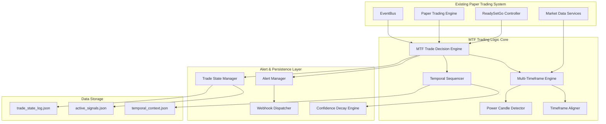
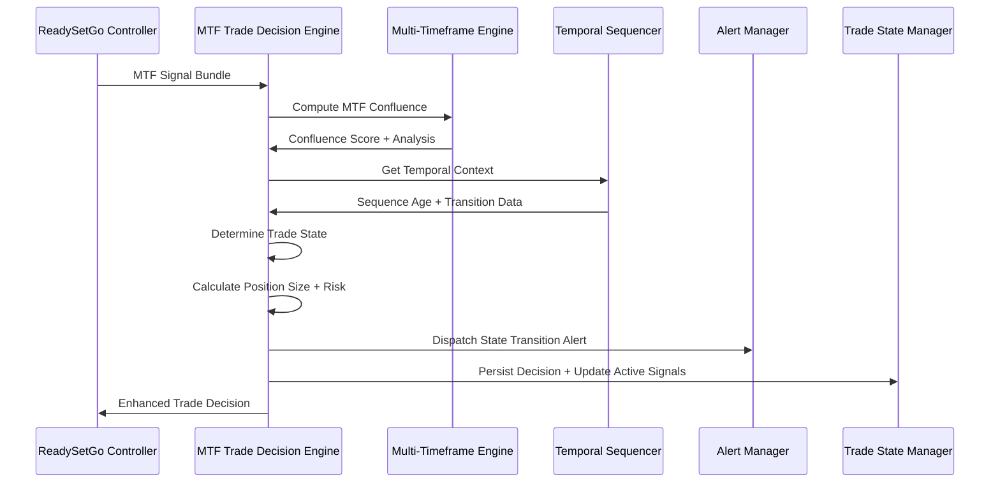
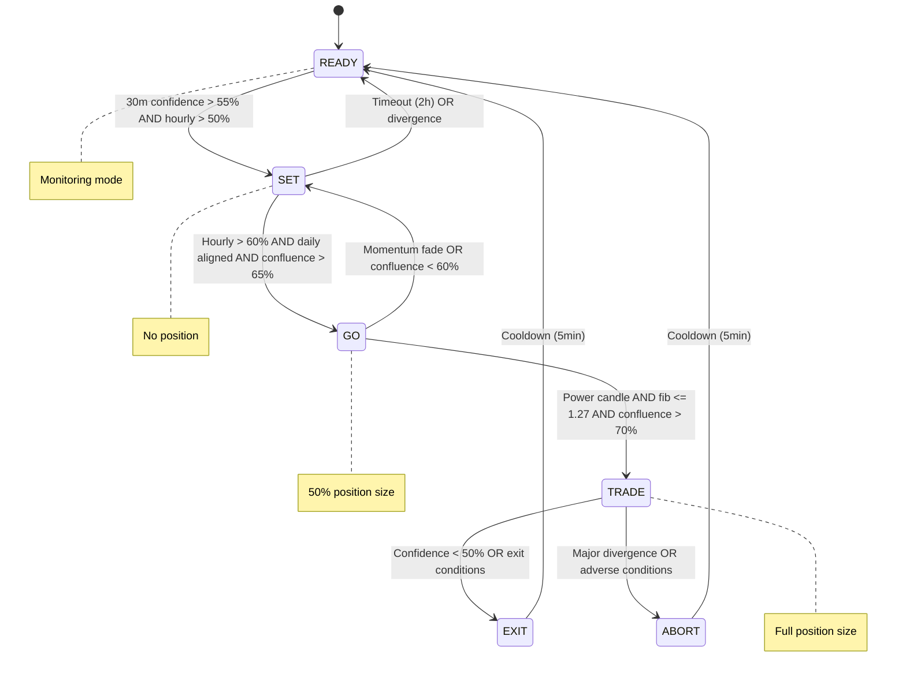

# Design Document

## Overview

The Multi-Timeframe Integrated Trading Logic v3.0 is designed as a sophisticated enhancement to the existing paper trading system, implementing professional-grade temporal state sequencing and multi-timeframe confluence analysis. The system follows an event-driven architecture with intelligent state transitions, dynamic risk management, and comprehensive alerting capabilities. The design emphasizes modularity, performance, and integration with existing systems while providing the temporal awareness and risk sophistication of professional trading desks.

## Architecture

### System Architecture Overview



### MTF Signal Processing Flow



### State Transition Architecture



## Components and Interfaces

### Core Engine Components

#### MTF Trade Decision Engine
```typescript
export interface TimeframeSignal {
  confidence: number;
  bias: 'LONG' | 'SHORT' | 'NEUTRAL';
  powerCandle: boolean;
  volumeSurge: boolean;
  ribbonAlignment: number;
  momentumDivergence: number;
  timestamp: number;
}

export interface MTFSignalBundle {
  ticker: string;
  daily: TimeframeSignal;
  hourly: TimeframeSignal;
  thirty: TimeframeSignal;
  regimeBias: number; // -1 to +1 scale
  fibZone: number;
  gammaExposure: number;
  vwapDeviation: number;
  prevState?: TradeState;
  sequenceStartTime?: number;
}

export type TradeState = 'READY' | 'SET' | 'GO' | 'TRADE' | 'EXIT' | 'ABORT';

export interface TradeDecision {
  ticker: string;
  state: TradeState;
  confidence: number;
  mtfConfluence: number;
  size: number;
  direction: 'LONG' | 'SHORT';
  timestamp: string;
  timeframeAlignment: {
    daily: boolean;
    hourly: boolean;
    thirty: boolean;
  };
  notes: string[];
  riskMetrics: {
    stopDistance: number;
    profitTarget: number;
    timeDecayBuffer: number;
  };
}

export class MTFTradeDecisionEngine {
  private temporalSequencer: TemporalSequencer;
  private alertManager: AlertManager;
  
  constructor(private eventBus: EventBus) {
    this.temporalSequencer = new TemporalSequencer();
    this.alertManager = new AlertManager();
  }
  
  public async processMTFSignal(signal: MTFSignalBundle): Promise<TradeDecision>;
  private computeMTFConfluence(signal: MTFSignalBundle): number;
  private determineTradeState(signal: MTFSignalBundle, confluence: number): TradeState;
  private computePositionSize(confidence: number, regimeBias: number, state: TradeState): number;
  private computeRiskMetrics(signal: MTFSignalBundle, state: TradeState, confluence: number): RiskMetrics;
  private handleStateTransition(signal: MTFSignalBundle, decision: TradeDecision): Promise<void>;
}
```

#### Temporal Sequencer
```typescript
export interface TemporalContext {
  sequenceAge: number;        // How long in current sequence
  timeSinceExit: number;      // Time since last EXIT/ABORT
  transitionCount: number;    // Number of state transitions
  lastTransition: number;     // Timestamp of last transition
}

export class TemporalSequencer {
  private sequences: Map<string, TemporalContext> = new Map();
  
  public getTemporalContext(signal: MTFSignalBundle): TemporalContext;
  public recordTransition(ticker: string, from: TradeState, to: TradeState): void;
  public shouldAllowTransition(currentState: TradeState, targetState: TradeState, context: TemporalContext): boolean;
  private enforceMinimumStateTimes(currentState: TradeState, context: TemporalContext): boolean;
  private preventRapidCycling(context: TemporalContext): boolean;
}
```

#### Multi-Timeframe Engine
```typescript
export interface ConfluenceAnalysis {
  baseConfluence: number;
  powerCandleBonus: number;
  volumeSurgeBonus: number;
  ribbonAlignmentBonus: number;
  gammaAdjustment: number;
  fibonacciAdjustment: number;
  totalConfluence: number;
}

export class MultiTimeframeEngine {
  public computeConfluence(signal: MTFSignalBundle): ConfluenceAnalysis;
  public analyzeTimeframeAlignment(signal: MTFSignalBundle): TimeframeAlignment;
  public detectPowerCandles(signals: TimeframeSignal[]): boolean;
  public calculateRibbonAlignment(signal: MTFSignalBundle): number;
  private applyGammaAdjustment(gammaExposure: number): number;
  private applyFibonacciAdjustment(fibZone: number): number;
}

export interface TimeframeAlignment {
  daily: boolean;
  hourly: boolean;
  thirty: boolean;
  overallAlignment: number;
  biasConsistency: boolean;
}
```

### Alert and Notification Components

#### Alert Manager
```typescript
export interface Alert {
  type: 'STATE_TRANSITION' | 'CONFIDENCE_DECAY' | 'RISK_ALERT' | 'SYSTEM_STATUS';
  priority: 'LOW' | 'MEDIUM' | 'HIGH' | 'CRITICAL';
  message: string;
  channels: ('slack' | 'telegram' | 'discord' | 'dashboard')[];
  data?: any;
  timestamp: number;
}

export class AlertManager {
  private webhookDispatcher: WebhookDispatcher;
  private cooldownManager: Map<string, number> = new Map();
  
  public async dispatchAlert(alert: Alert): Promise<void>;
  private async sendToChannel(alert: Alert, channel: string): Promise<void>;
  private formatSlackMessage(alert: Alert): SlackMessage;
  private formatTelegramMessage(alert: Alert): string;
  private formatDiscordMessage(alert: Alert): DiscordEmbed;
  private getCooldownMs(priority: string): number;
}
```

#### Webhook Dispatcher
```typescript
export class WebhookDispatcher {
  private slackWebhook: string;
  private telegramBot: TelegramBot;
  private discordWebhook: string;
  
  public async sendToSlack(message: SlackMessage): Promise<void>;
  public async sendToTelegram(message: string): Promise<void>;
  public async sendToDiscord(embed: DiscordEmbed): Promise<void>;
  private retryWithBackoff<T>(operation: () => Promise<T>, maxRetries: number): Promise<T>;
}
```

### Persistence and State Management

#### Trade State Manager
```typescript
export interface TradeStateLog {
  entries: TradeDecision[];
  metadata: {
    version: string;
    createdAt: string;
    lastUpdated: string;
  };
}

export class TradeStateManager {
  private static readonly LOG_FILE = 'data/trade_state_log.json';
  private static readonly ACTIVE_SIGNALS_FILE = 'data/active_signals.json';
  
  public static async persist(decision: TradeDecision): Promise<void>;
  public static async getRecentDecisions(ticker: string, limit?: number): Promise<TradeDecision[]>;
  public static async getActiveSignals(): Promise<Record<string, TradeDecision>>;
  private static async appendToLog(decision: TradeDecision): Promise<void>;
  private static async updateActiveSignals(decision: TradeDecision): Promise<void>;
  private static async ensureDataDirectory(): Promise<void>;
}
```

#### Confidence Decay Engine
```typescript
export interface ConfidenceDecayConfig {
  decayRate: number;
  minimumConfidence: number;
  timeWindow: number;
  decayFunction: 'LINEAR' | 'EXPONENTIAL' | 'LOGARITHMIC';
}

export class ConfidenceDecayEngine {
  private decayConfig: ConfidenceDecayConfig;
  
  public calculateDecayedConfidence(originalConfidence: number, timeElapsed: number): number;
  public shouldApplyDecay(signal: MTFSignalBundle): boolean;
  public getDecayMultiplier(timeElapsed: number): number;
  private applyLinearDecay(confidence: number, timeElapsed: number): number;
  private applyExponentialDecay(confidence: number, timeElapsed: number): number;
}
```

## Data Models

### Core Data Structures

#### MTF Configuration Model
```typescript
export interface MTFConfiguration {
  timeframeWeights: {
    daily: number;
    hourly: number;
    thirty: number;
  };
  confidenceThresholds: {
    readyToSet: number;
    setToGo: number;
    goToTrade: number;
    tradeToExit: number;
  };
  bonusMultipliers: {
    powerCandle: number;
    volumeSurge: number;
    ribbonAlignment: number;
  };
  riskAdjustments: {
    highConfidenceMultiplier: number;
    mediumConfidenceMultiplier: number;
    lowConfidenceMultiplier: number;
    regimeBiasAdjustment: number;
  };
  stateTiming: {
    minimumStateDurations: Record<TradeState, number>;
    sequenceTimeout: number;
    cooldownPeriod: number;
  };
  alertSettings: {
    channels: string[];
    priorities: Record<TradeState, AlertPriority>;
    cooldownPeriods: Record<AlertPriority, number>;
  };
}
```

#### Temporal Context Model
```typescript
export interface TemporalContextData {
  ticker: string;
  currentState: TradeState;
  stateEntryTime: number;
  sequenceStartTime: number;
  lastTransitionTime: number;
  transitionHistory: StateTransition[];
  cyclingPrevention: {
    transitionCount: number;
    windowStart: number;
    blocked: boolean;
  };
}

export interface StateTransition {
  from: TradeState;
  to: TradeState;
  timestamp: number;
  reason: string;
  confluence: number;
  context: any;
}
```

### File System Data Models

#### Trade State Log Structure
```json
{
  "entries": [
    {
      "ticker": "AAPL",
      "state": "TRADE",
      "confidence": 0.752,
      "mtfConfluence": 0.752,
      "size": 1.25,
      "direction": "LONG",
      "timestamp": "2024-01-15T10:30:00Z",
      "timeframeAlignment": {
        "daily": true,
        "hourly": true,
        "thirty": true
      },
      "notes": [
        "All timeframes aligned — executing entry",
        "Power candle detected — momentum surge",
        "High MTF confluence — optimal entry conditions"
      ],
      "riskMetrics": {
        "stopDistance": 0.016,
        "profitTarget": 0.072,
        "timeDecayBuffer": 1.0
      }
    }
  ],
  "metadata": {
    "version": "3.0",
    "createdAt": "2024-01-15T00:00:00Z",
    "lastUpdated": "2024-01-15T10:30:00Z"
  }
}
```

#### Active Signals Structure
```json
{
  "AAPL": {
    "ticker": "AAPL",
    "state": "GO",
    "confidence": 0.68,
    "lastUpdate": "2024-01-15T10:25:00Z",
    "sequenceAge": 1800000,
    "nextEvaluation": "2024-01-15T10:30:00Z"
  },
  "MSFT": {
    "ticker": "MSFT",
    "state": "SET",
    "confidence": 0.62,
    "lastUpdate": "2024-01-15T10:20:00Z",
    "sequenceAge": 600000,
    "nextEvaluation": "2024-01-15T10:35:00Z"
  }
}
```

## Error Handling

### Error Handling Strategy

#### MTF Processing Errors
```typescript
export class MTFProcessingError extends Error {
  constructor(
    message: string,
    public ticker: string,
    public state: TradeState,
    public recoverable: boolean = true
  ) {
    super(message);
    this.name = 'MTFProcessingError';
  }
}

export interface ErrorRecoveryStrategy {
  handleConfluenceCalculationError(error: Error, signal: MTFSignalBundle): Promise<number>;
  handleStateTransitionError(error: Error, currentState: TradeState): Promise<TradeState>;
  handlePersistenceError(error: Error, decision: TradeDecision): Promise<void>;
  handleAlertDispatchError(error: Error, alert: Alert): Promise<void>;
}
```

#### Graceful Degradation
1. **Confluence Calculation Failure**: Use simplified scoring with available data
2. **Temporal Context Loss**: Reconstruct from recent decisions and current market state
3. **Alert Dispatch Failure**: Queue alerts for retry with exponential backoff
4. **Persistence Failure**: Maintain in-memory state and retry with circuit breaker
5. **State Corruption**: Reset to READY state with full audit logging

#### Recovery Mechanisms
```typescript
export class MTFErrorRecovery {
  public async recoverFromStateCorruption(ticker: string): Promise<TradeState>;
  public async reconstructTemporalContext(ticker: string): Promise<TemporalContext>;
  public async validateAndRepairPersistence(): Promise<void>;
  public async retryFailedAlerts(): Promise<void>;
  private async performHealthCheck(): Promise<SystemHealth>;
}
```

## Testing Strategy

### Unit Testing Approach

#### Core Logic Testing
```typescript
describe('MTFTradeDecisionEngine', () => {
  test('should compute MTF confluence with correct weightings', () => {
    const signal = createMockMTFSignal({
      daily: { confidence: 0.8 },
      hourly: { confidence: 0.7 },
      thirty: { confidence: 0.6 }
    });
    
    const confluence = engine.computeMTFConfluence(signal);
    const expected = (0.8 * 0.4) + (0.7 * 0.35) + (0.6 * 0.25);
    
    expect(confluence).toBeCloseTo(expected, 3);
  });

  test('should apply power candle bonus correctly', () => {
    const signalWithPowerCandle = createMockMTFSignal({
      thirty: { powerCandle: true, confidence: 0.6 }
    });
    
    const confluence = engine.computeMTFConfluence(signalWithPowerCandle);
    expect(confluence).toBeGreaterThan(0.6);
  });

  test('should transition states based on confluence thresholds', () => {
    const signal = createMockMTFSignal({
      prevState: 'SET',
      hourly: { confidence: 0.65, bias: 'LONG' },
      daily: { bias: 'LONG' }
    });
    
    const decision = engine.processMTFSignal(signal);
    expect(decision.state).toBe('GO');
  });
});

describe('TemporalSequencer', () => {
  test('should prevent rapid state cycling', () => {
    const context = {
      transitionCount: 4,
      sequenceAge: 200000, // 3.33 minutes
      lastTransition: Date.now() - 30000
    };
    
    const allowed = sequencer.shouldAllowTransition('SET', 'GO', context);
    expect(allowed).toBe(false);
  });

  test('should enforce minimum state durations', () => {
    const context = {
      lastTransition: Date.now() - 30000, // 30 seconds ago
      transitionCount: 1,
      sequenceAge: 30000
    };
    
    const allowed = sequencer.shouldAllowTransition('SET', 'GO', context);
    expect(allowed).toBe(false); // SET requires 2 minutes minimum
  });
});
```

#### Integration Testing
```typescript
describe('MTF Integration', () => {
  test('should handle complete signal processing workflow', async () => {
    const signal = createMockMTFSignal();
    
    const decision = await engine.processMTFSignal(signal);
    
    expect(decision).toBeDefined();
    expect(decision.confidence).toBeGreaterThan(0);
    expect(decision.notes).toHaveLength.greaterThan(0);
    
    // Verify persistence
    const recentDecisions = await TradeStateManager.getRecentDecisions(signal.ticker, 1);
    expect(recentDecisions[0].ticker).toBe(signal.ticker);
  });

  test('should emit proper events for state transitions', async () => {
    const eventSpy = jest.spyOn(eventBus, 'emit');
    const signal = createMockMTFSignal({ prevState: 'SET' });
    
    await engine.processMTFSignal(signal);
    
    expect(eventSpy).toHaveBeenCalledWith('trade:state:transition', expect.objectContaining({
      ticker: signal.ticker,
      from: 'SET',
      to: expect.any(String)
    }));
  });
});
```

### Performance Testing

#### Load Testing Strategy
1. **Concurrent Signal Processing**: Test 20+ simultaneous MTF signal analyses
2. **State Transition Performance**: Validate sub-200ms processing times
3. **Memory Usage**: Monitor memory consumption during extended operation
4. **Alert Dispatch Performance**: Test multi-channel alert delivery under load
5. **Persistence Performance**: Validate file I/O performance with high frequency updates

### End-to-End Testing

#### Complete Workflow Testing
1. **Signal Reception**: ReadySetGo → MTF Engine → Decision Output
2. **State Progression**: READY → SET → GO → TRADE → EXIT cycle
3. **Alert Delivery**: State transitions → Multi-channel notifications
4. **Persistence Integrity**: Decision logging → State recovery → Audit trails
5. **Error Recovery**: System failures → Graceful degradation → Full recovery

## Implementation Phases

### Phase 1: Core MTF Engine (Week 1)
- Implement MTFTradeDecisionEngine with confluence scoring
- Create TemporalSequencer with state transition logic
- Build MultiTimeframeEngine for signal analysis
- Add basic persistence with TradeStateManager

### Phase 2: Alert and Notification System (Week 2)
- Implement AlertManager with multi-channel support
- Create WebhookDispatcher for external integrations
- Add alert formatting and delivery mechanisms
- Build cooldown and priority management

### Phase 3: Advanced Features (Week 3)
- Add PowerCandleDetector and TimeframeAligner
- Implement ConfidenceDecayEngine for temporal adjustments
- Create comprehensive error handling and recovery
- Add configuration management and validation

### Phase 4: Integration and Testing (Week 4)
- Integrate with existing paper trading system
- Implement EventBus integration and event emission
- Add comprehensive test suite and performance validation
- Conduct integration testing with ReadySetGo Controller

### Phase 5: Production Readiness (Week 5)
- Add monitoring and health check capabilities
- Implement security measures and input validation
- Create deployment procedures and documentation
- Conduct user acceptance testing and performance optimization