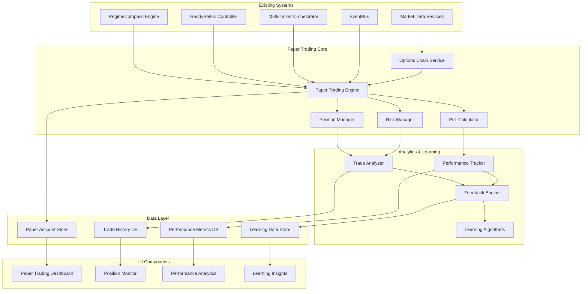
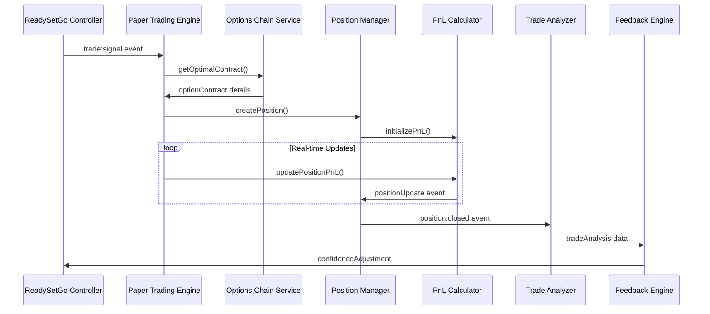

# Design Document

## Overview

The Paper Trading System is architected as a comprehensive simulation environment that seamlessly integrates with the existing Gamma Adaptive Trading System, Smart Options Recommendation Engine (RegimeCompass), and ReadySetGo Multi-Ticker Orchestrator. The system follows an event-driven architecture with real-time position management, sophisticated options pricing, and machine learning feedback loops. The design emphasizes modularity, performance, and realistic trading simulation to provide valuable insights for algorithm improvement.

## Architecture

### System Integration Architecture



### Event Flow Architecture



## Components and Interfaces

### Core Engine Components

#### Paper Trading Engine
```typescript
interface PaperTradingEngine {
  executePaperTrade(signal: TradeSignal): Promise<string>;
  closePosition(positionId: string, reason: ExitReason): Promise<void>;
  updatePositions(marketData: MarketData): void;
  getAccountBalance(): number;
  getOpenPositions(): PaperPosition[];
  getPerformanceMetrics(): PerformanceMetrics;
}

interface TradeSignal {
  signalId: string;
  ticker: string;
  side: 'LONG' | 'SHORT';
  confidence: number;
  conviction: number;
  expectedMove: number;
  timeframe: 'SHORT' | 'MEDIUM' | 'LONG';
  regime: 'BULL' | 'BEAR' | 'NEUTRAL';
  source: 'REGIMECOMPASS' | 'READYSETGO' | 'MANUAL';
}

interface PaperPosition {
  id: string;
  signalId: string;
  ticker: string;
  optionSymbol: string;
  contractType: 'CALL' | 'PUT';
  strike: number;
  expiration: Date;
  side: 'LONG' | 'SHORT';
  quantity: number;
  entryPrice: number;
  currentPrice: number;
  entryTimestamp: Date;
  exitTimestamp?: Date;
  exitPrice?: number;
  pnl: number;
  pnlPercent: number;
  maxFavorableExcursion: number;
  maxAdverseExcursion: number;
  greeks: OptionsGreeks;
  status: 'OPEN' | 'CLOSED' | 'EXPIRED';
  confidence: number;
  conviction: number;
  regime: string;
  exitReason?: ExitReason;
}

interface OptionsGreeks {
  delta: number;
  gamma: number;
  theta: number;
  vega: number;
  rho: number;
  impliedVolatility: number;
}

type ExitReason = 'PROFIT_TARGET' | 'STOP_LOSS' | 'TIME_DECAY' | 'EXPIRATION' | 'RISK_MANAGEMENT' | 'MANUAL';
```

#### Options Chain Service
```typescript
interface OptionsChainService {
  getOptionsChain(ticker: string, expiration?: Date): Promise<OptionsChain>;
  findOptimalContract(
    ticker: string, 
    direction: 'CALL' | 'PUT', 
    confidence: number,
    expectedMove: number,
    timeframe: string
  ): Promise<OptionContract>;
  calculateGreeks(contract: OptionContract, underlyingPrice: number): OptionsGreeks;
  getImpliedVolatility(contract: OptionContract): number;
}

interface OptionsChain {
  ticker: string;
  underlyingPrice: number;
  expirations: Date[];
  calls: OptionContract[];
  puts: OptionContract[];
  timestamp: Date;
}

interface OptionContract {
  symbol: string;
  strike: number;
  expiration: Date;
  type: 'CALL' | 'PUT';
  bid: number;
  ask: number;
  midPrice: number;
  volume: number;
  openInterest: number;
  impliedVolatility: number;
  greeks: OptionsGreeks;
  daysToExpiration: number;
}
```

#### Position Manager
```typescript
interface PositionManager {
  createPosition(signal: TradeSignal, contract: OptionContract): Promise<PaperPosition>;
  updatePosition(positionId: string, marketData: MarketData): void;
  closePosition(positionId: string, exitPrice: number, reason: ExitReason): Promise<void>;
  getPosition(positionId: string): PaperPosition | null;
  getPositionsByTicker(ticker: string): PaperPosition[];
  getAllOpenPositions(): PaperPosition[];
  calculatePositionSize(signal: TradeSignal, contract: OptionContract, accountBalance: number): number;
}

interface MarketData {
  ticker: string;
  price: number;
  timestamp: Date;
  options: Record<string, OptionQuote>;
}

interface OptionQuote {
  bid: number;
  ask: number;
  midPrice: number;
  impliedVolatility: number;
  delta: number;
  gamma: number;
  theta: number;
  vega: number;
}
```

### Analytics and Learning Components

#### Trade Analyzer
```typescript
interface TradeAnalyzer {
  analyzeClosedTrade(position: PaperPosition): TradeAnalysis;
  calculatePerformanceMetrics(trades: PaperPosition[]): PerformanceMetrics;
  identifyPatterns(trades: PaperPosition[]): TradingPattern[];
  generateInsights(analysis: TradeAnalysis[]): TradingInsight[];
}

interface TradeAnalysis {
  positionId: string;
  signalId: string;
  ticker: string;
  entryConfidence: number;
  actualOutcome: 'WIN' | 'LOSS';
  pnl: number;
  pnlPercent: number;
  holdingPeriod: number;
  maxFavorableExcursion: number;
  maxAdverseExcursion: number;
  confidenceEffectiveness: number;
  expectedVsActualMove: number;
  greeksImpact: GreeksImpact;
  marketRegime: string;
  exitReason: ExitReason;
  learnings: string[];
}

interface PerformanceMetrics {
  totalTrades: number;
  winningTrades: number;
  losingTrades: number;
  winRate: number;
  totalPnL: number;
  averageWin: number;
  averageLoss: number;
  profitFactor: number;
  sharpeRatio: number;
  maxDrawdown: number;
  maxDrawdownPercent: number;
  averageHoldingPeriod: number;
  bestTrade: number;
  worstTrade: number;
  consecutiveWins: number;
  consecutiveLosses: number;
  accountBalance: number;
  returnsPercent: number;
}

interface GreeksImpact {
  deltaContribution: number;
  gammaContribution: number;
  thetaContribution: number;
  vegaContribution: number;
  totalGreeksImpact: number;
}
```

#### Feedback Engine
```typescript
interface FeedbackEngine {
  analyzeTradeOutcome(analysis: TradeAnalysis): void;
  adjustConfidenceThresholds(signalType: string, effectiveness: number): void;
  generateRecommendations(performanceData: PerformanceMetrics): Recommendation[];
  getAdjustedConfidence(signalType: string, rawConfidence: number): number;
  getLearningInsights(): LearningInsight[];
}

interface Recommendation {
  type: 'POSITION_SIZING' | 'ENTRY_TIMING' | 'EXIT_STRATEGY' | 'RISK_MANAGEMENT';
  priority: 'HIGH' | 'MEDIUM' | 'LOW';
  description: string;
  impact: string;
  implementation: string;
}

interface LearningInsight {
  category: 'CONFIDENCE_CALIBRATION' | 'MARKET_REGIME' | 'OPTIONS_SELECTION' | 'TIMING';
  insight: string;
  confidence: number;
  supportingData: any;
  actionable: boolean;
}
```

### Risk Management Components

#### Risk Manager
```typescript
interface RiskManager {
  validateTrade(signal: TradeSignal, accountBalance: number): RiskValidation;
  calculatePositionSize(signal: TradeSignal, contract: OptionContract, accountBalance: number): number;
  checkPortfolioRisk(openPositions: PaperPosition[], newPosition: PaperPosition): boolean;
  enforceRiskLimits(positions: PaperPosition[]): RiskAction[];
  getPortfolioMetrics(positions: PaperPosition[], accountBalance: number): PortfolioRisk;
}

interface RiskValidation {
  approved: boolean;
  reason?: string;
  maxPositionSize: number;
  riskScore: number;
  warnings: string[];
}

interface RiskAction {
  type: 'REDUCE_POSITION' | 'CLOSE_POSITION' | 'HALT_TRADING' | 'ALERT';
  positionId?: string;
  severity: 'LOW' | 'MEDIUM' | 'HIGH' | 'CRITICAL';
  description: string;
  autoExecute: boolean;
}

interface PortfolioRisk {
  totalExposure: number;
  portfolioHeat: number;
  maxDrawdown: number;
  currentDrawdown: number;
  riskScore: number;
  concentrationRisk: number;
  correlationRisk: number;
}
```

## Data Models

### Core Data Structures

#### Paper Account Model
```typescript
interface PaperAccount {
  id: string;
  initialBalance: number;
  currentBalance: number;
  totalPnL: number;
  totalPnLPercent: number;
  availableBalance: number;
  marginUsed: number;
  buyingPower: number;
  dayTradingBuyingPower: number;
  createdAt: Date;
  lastUpdated: Date;
  riskSettings: RiskSettings;
  performanceMetrics: PerformanceMetrics;
}

interface RiskSettings {
  maxRiskPerTrade: number; // Percentage of account
  maxPortfolioHeat: number; // Percentage of account at risk
  maxDrawdown: number; // Maximum acceptable drawdown
  maxConsecutiveLosses: number;
  maxPositionSize: number; // Percentage of account per position
  stopLossPercent: number;
  profitTargetMultiple: number;
  timeDecayThreshold: number;
}
```

#### Trade History Model
```typescript
interface TradeHistory {
  id: string;
  accountId: string;
  position: PaperPosition;
  analysis: TradeAnalysis;
  marketConditions: MarketConditions;
  createdAt: Date;
}

interface MarketConditions {
  regime: string;
  vix: number;
  marketTrend: string;
  sectorRotation: string;
  volatilityEnvironment: 'LOW' | 'MEDIUM' | 'HIGH';
  marketBreadth: number;
}
```

### Database Schema Design

#### Supabase Tables
```sql
-- Paper Accounts
CREATE TABLE paper_accounts (
  id UUID DEFAULT gen_random_uuid() PRIMARY KEY,
  user_id UUID REFERENCES auth.users(id),
  initial_balance DECIMAL(12,2) NOT NULL DEFAULT 100000,
  current_balance DECIMAL(12,2) NOT NULL,
  total_pnl DECIMAL(12,2) NOT NULL DEFAULT 0,
  available_balance DECIMAL(12,2) NOT NULL,
  margin_used DECIMAL(12,2) NOT NULL DEFAULT 0,
  risk_settings JSONB NOT NULL,
  created_at TIMESTAMPTZ DEFAULT NOW(),
  updated_at TIMESTAMPTZ DEFAULT NOW()
);

-- Paper Positions
CREATE TABLE paper_positions (
  id UUID DEFAULT gen_random_uuid() PRIMARY KEY,
  account_id UUID REFERENCES paper_accounts(id),
  signal_id VARCHAR(50) NOT NULL,
  ticker VARCHAR(10) NOT NULL,
  option_symbol VARCHAR(50) NOT NULL,
  contract_type VARCHAR(4) NOT NULL CHECK (contract_type IN ('CALL', 'PUT')),
  strike DECIMAL(10,2) NOT NULL,
  expiration DATE NOT NULL,
  side VARCHAR(5) NOT NULL CHECK (side IN ('LONG', 'SHORT')),
  quantity INTEGER NOT NULL,
  entry_price DECIMAL(8,4) NOT NULL,
  current_price DECIMAL(8,4) NOT NULL,
  entry_timestamp TIMESTAMPTZ NOT NULL,
  exit_timestamp TIMESTAMPTZ,
  exit_price DECIMAL(8,4),
  pnl DECIMAL(12,2) NOT NULL DEFAULT 0,
  pnl_percent DECIMAL(8,4) NOT NULL DEFAULT 0,
  max_favorable_excursion DECIMAL(12,2) NOT NULL DEFAULT 0,
  max_adverse_excursion DECIMAL(12,2) NOT NULL DEFAULT 0,
  greeks JSONB NOT NULL,
  status VARCHAR(10) NOT NULL DEFAULT 'OPEN' CHECK (status IN ('OPEN', 'CLOSED', 'EXPIRED')),
  confidence DECIMAL(4,3) NOT NULL,
  conviction DECIMAL(4,3) NOT NULL,
  regime VARCHAR(10) NOT NULL,
  exit_reason VARCHAR(20),
  created_at TIMESTAMPTZ DEFAULT NOW(),
  updated_at TIMESTAMPTZ DEFAULT NOW()
);

-- Trade Analysis
CREATE TABLE trade_analyses (
  id UUID DEFAULT gen_random_uuid() PRIMARY KEY,
  position_id UUID REFERENCES paper_positions(id),
  signal_id VARCHAR(50) NOT NULL,
  entry_confidence DECIMAL(4,3) NOT NULL,
  actual_outcome VARCHAR(4) NOT NULL CHECK (actual_outcome IN ('WIN', 'LOSS')),
  holding_period INTEGER NOT NULL, -- in minutes
  confidence_effectiveness DECIMAL(6,4) NOT NULL,
  expected_vs_actual_move DECIMAL(6,4) NOT NULL,
  greeks_impact JSONB NOT NULL,
  market_regime VARCHAR(10) NOT NULL,
  learnings TEXT[],
  created_at TIMESTAMPTZ DEFAULT NOW()
);

-- Performance Metrics
CREATE TABLE performance_metrics (
  id UUID DEFAULT gen_random_uuid() PRIMARY KEY,
  account_id UUID REFERENCES paper_accounts(id),
  period_start TIMESTAMPTZ NOT NULL,
  period_end TIMESTAMPTZ NOT NULL,
  total_trades INTEGER NOT NULL,
  winning_trades INTEGER NOT NULL,
  losing_trades INTEGER NOT NULL,
  win_rate DECIMAL(5,2) NOT NULL,
  total_pnl DECIMAL(12,2) NOT NULL,
  average_win DECIMAL(12,2) NOT NULL,
  average_loss DECIMAL(12,2) NOT NULL,
  profit_factor DECIMAL(6,2) NOT NULL,
  sharpe_ratio DECIMAL(6,4),
  max_drawdown DECIMAL(12,2) NOT NULL,
  max_drawdown_percent DECIMAL(5,2) NOT NULL,
  created_at TIMESTAMPTZ DEFAULT NOW()
);

-- Learning Data
CREATE TABLE learning_data (
  id UUID DEFAULT gen_random_uuid() PRIMARY KEY,
  signal_type VARCHAR(50) NOT NULL,
  confidence_adjustment DECIMAL(4,3) NOT NULL DEFAULT 0,
  effectiveness_score DECIMAL(6,4) NOT NULL,
  sample_size INTEGER NOT NULL,
  last_updated TIMESTAMPTZ DEFAULT NOW(),
  insights JSONB,
  created_at TIMESTAMPTZ DEFAULT NOW()
);
```

## Error Handling

### Error Handling Strategy

#### Service Layer Error Handling
```typescript
class PaperTradingError extends Error {
  constructor(
    message: string,
    public code: string,
    public severity: 'LOW' | 'MEDIUM' | 'HIGH' | 'CRITICAL',
    public recoverable: boolean = true
  ) {
    super(message);
    this.name = 'PaperTradingError';
  }
}

interface ErrorHandler {
  handleTradeExecutionError(error: PaperTradingError): Promise<void>;
  handleDataSourceError(error: Error): Promise<void>;
  handlePositionUpdateError(error: Error): Promise<void>;
  handleRiskViolationError(error: Error): Promise<void>;
}
```

#### Graceful Degradation Strategies
1. **Options Data Failure**: Use synthetic pricing with Black-Scholes model
2. **Position Update Failure**: Queue updates for retry with exponential backoff
3. **Risk Calculation Error**: Use conservative defaults and alert administrators
4. **Database Connection Loss**: Cache operations locally and sync when reconnected
5. **Market Data Delay**: Use last known prices with staleness indicators

#### Recovery Mechanisms
```typescript
interface ErrorRecovery {
  retryWithBackoff<T>(operation: () => Promise<T>, maxRetries: number): Promise<T>;
  fallbackToSyntheticData(ticker: string): Promise<OptionContract[]>;
  queueFailedOperation(operation: FailedOperation): void;
  recoverFromDataLoss(lastKnownState: SystemState): Promise<void>;
}
```

## Testing Strategy

### Unit Testing Approach

#### Core Logic Testing
```typescript
describe('PaperTradingEngine', () => {
  test('should execute paper trade with correct position sizing', async () => {
    const signal = createMockSignal({ confidence: 0.8, conviction: 0.9 });
    const positionId = await paperEngine.executePaperTrade(signal);
    
    const position = await positionManager.getPosition(positionId);
    expect(position).toBeDefined();
    expect(position.quantity).toBeGreaterThan(0);
    expect(position.confidence).toBe(0.8);
  });

  test('should handle concurrent trade execution', async () => {
    const signals = [
      createMockSignal({ ticker: 'SPY' }),
      createMockSignal({ ticker: 'QQQ' }),
      createMockSignal({ ticker: 'IWM' })
    ];
    
    const results = await Promise.all(
      signals.map(signal => paperEngine.executePaperTrade(signal))
    );
    
    expect(results).toHaveLength(3);
    expect(new Set(results).size).toBe(3); // All unique position IDs
  });
});

describe('OptionsChainService', () => {
  test('should select optimal contract based on confidence', async () => {
    const highConfidenceContract = await optionsService.findOptimalContract(
      'SPY', 'CALL', 0.9, 2.5, 'MEDIUM'
    );
    const lowConfidenceContract = await optionsService.findOptimalContract(
      'SPY', 'CALL', 0.5, 2.5, 'SHORT'
    );
    
    expect(highConfidenceContract.daysToExpiration).toBeGreaterThan(
      lowConfidenceContract.daysToExpiration
    );
  });
});
```

#### Integration Testing
```typescript
describe('Paper Trading Integration', () => {
  test('should handle complete trade lifecycle', async () => {
    // Setup
    const signal = createMockSignal();
    mockMarketData();
    
    // Execute trade
    const positionId = await paperEngine.executePaperTrade(signal);
    
    // Update position
    await paperEngine.updatePositions(getMockMarketUpdate());
    
    // Close position
    await paperEngine.closePosition(positionId, 'PROFIT_TARGET');
    
    // Verify analysis
    const analysis = await tradeAnalyzer.getAnalysis(positionId);
    expect(analysis).toBeDefined();
    expect(analysis.actualOutcome).toBe('WIN');
  });
});
```

### Performance Testing

#### Load Testing Strategy
1. **Concurrent Trade Execution**: Test 50+ simultaneous trade signals
2. **Position Updates**: Validate 1000+ position updates per second
3. **Memory Usage**: Monitor memory consumption during extended operation
4. **Database Performance**: Test query performance with 10,000+ trades
5. **Real-time Updates**: Ensure UI updates within 100ms of data changes

### End-to-End Testing

#### User Journey Testing
1. **Complete Trading Cycle**: Signal generation → execution → monitoring → closure
2. **Performance Analytics**: Dashboard loading and metric calculations
3. **Risk Management**: Automatic position sizing and risk limit enforcement
4. **Learning System**: Feedback loop and confidence adjustments
5. **Error Scenarios**: System behavior during API failures and data issues

## Implementation Phases

### Phase 1: Core Infrastructure (Week 1)
- Set up paper trading engine foundation
- Implement basic position management
- Create options chain service integration
- Build fundamental database schema

### Phase 2: Trading Execution (Week 2)
- Implement automated trade execution
- Add real-time position updates
- Create risk management system
- Build PnL calculation engine

### Phase 3: Analytics and Learning (Week 3)
- Implement trade analysis system
- Create performance metrics calculation
- Build feedback engine for algorithm learning
- Add learning insights generation

### Phase 4: Dashboard and UI (Week 4)
- Create paper trading dashboard components
- Implement real-time position monitoring
- Build performance analytics visualization
- Add learning insights display

### Phase 5: Integration and Testing (Week 5)
- Integrate with existing systems (RegimeCompass, ReadySetGo)
- Implement comprehensive error handling
- Add performance optimization
- Conduct thorough testing and bug fixes

### Phase 6: Production Readiness (Week 6)
- Add monitoring and alerting
- Implement security measures
- Create deployment procedures
- Conduct user acceptance testing