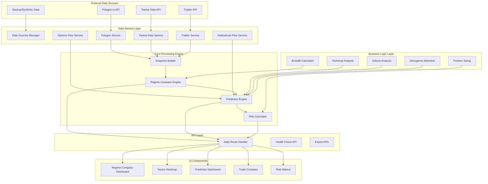

# Design Document

## Overview

The Regime Compass is architected as a modern Next.js application with TypeScript, implementing a sophisticated multi-layered system for market regime detection and trading signal generation. The system follows a service-oriented architecture with clear separation between data acquisition, signal processing, predictive analytics, and user interface components. The design emphasizes real-time performance, fault tolerance, and extensibility to support both discretionary and algorithmic trading workflows.

## Architecture

### System Architecture Diagram



### Data Flow Architecture

The system implements a unidirectional data flow pattern:

1. **Data Ingestion**: Multiple external APIs provide market data concurrently
2. **Data Validation**: Zod schemas ensure data integrity and type safety
3. **Signal Processing**: Core engines process raw data into actionable signals
4. **Predictive Analysis**: Forward-looking algorithms generate probability-based forecasts
5. **Risk Management**: Position sizing and risk metrics are calculated
6. **UI Rendering**: React components display processed information with real-time updates

## Components and Interfaces

### Core Engine Components

#### RegimeCompass Engine
```typescript
interface RegimeCompassEngine {
  classify(snapshot: MarketSnapshot): RegimeClassification;
  calculateRegimeStrength(snapshot: MarketSnapshot): number;
  detectEarlyWarningSignals(snapshot: MarketSnapshot): EarlyWarningSignals;
}

interface RegimeClassification {
  regime: 'BULL' | 'BEAR' | 'NEUTRAL';
  confidence: number;
  factors: {
    breadth: boolean;
    emaAlignment: boolean;
    trendScore: boolean;
    volatility: boolean;
    gamma: boolean;
  };
  strength: number; // 0-100
}
```

#### Predictive Engine
```typescript
interface PredictiveEngine {
  generatePredictions(snapshot: MarketSnapshot): Promise<PredictiveSignals>;
  analyzeDivergences(snapshot: MarketSnapshot): MomentumDivergence;
  analyzeVolume(snapshot: MarketSnapshot): VolumeAnalysis;
  analyzeOptionsFlow(snapshot: MarketSnapshot): OptionsFlow;
  calculateRegimeProbability(snapshot: MarketSnapshot): RegimeProbability;
}

interface PredictiveSignals {
  momentumDivergence: {
    type: 'bullish' | 'bearish' | 'none';
    strength: number;
    timeframe: 'short' | 'medium';
  };
  volumeAnalysis: {
    confirmation: boolean;
    thrust: 'up' | 'down' | 'none';
    exhaustion: boolean;
  };
  optionsFlow: {
    bias: 'bullish' | 'bearish' | 'neutral';
    confidence: number;
    unusualActivity: boolean;
  };
  projectedLevels: {
    support: number[];
    resistance: number[];
    pivot: number;
    expectedMove: number;
  };
  regimeProbability: {
    nextWeek: { BULL: number; BEAR: number; NEUTRAL: number };
    nextMonth: { BULL: number; BEAR: number; NEUTRAL: number };
  };
}
```

#### Snapshot Builder
```typescript
interface SnapshotBuilder {
  buildMarketSnapshot(): Promise<MarketSnapshot>;
  validateDataIntegrity(data: any): boolean;
  handleDataSourceFailure(source: string, error: Error): void;
}

interface MarketSnapshot {
  timestamp: Date;
  regime: 'BULL' | 'BEAR' | 'NEUTRAL';
  breadth: {
    breadthPct: number;
    advancingStocks: number;
    decliningStocks: number;
  };
  indexes: {
    SPY: IndexData;
    QQQ: IndexData;
    IWM: IndexData;
  };
  sectors: Record<string, SectorData>;
  derivedSignals: {
    volatilityTrend: 'rising' | 'falling' | 'flat';
    momentumScore: number;
    regimeStrength: number;
  };
  predictiveSignals: PredictiveSignals;
  riskMetrics: RiskMetrics;
}
```

### Data Service Layer

#### Service Integration Pattern
```typescript
interface DataService {
  fetchData(): Promise<ServiceResponse>;
  validateConnection(): Promise<boolean>;
  handleRateLimit(): Promise<void>;
  getCachedData(): ServiceResponse | null;
}

interface ServiceResponse {
  data: any;
  timestamp: Date;
  source: string;
  status: 'success' | 'error' | 'cached';
}
```

#### Polygon Service
```typescript
interface PolygonService extends DataService {
  fetchMarketData(symbols: string[]): Promise<MarketData>;
  fetchSectorETFs(): Promise<SectorData[]>;
  fetchVolumeData(symbol: string): Promise<VolumeData>;
}
```

#### Twelve Data Service
```typescript
interface TwelveDataService extends DataService {
  fetchVIXData(): Promise<VIXData>;
  fetchMovingAverages(symbol: string): Promise<MovingAverageData>;
  fetchTechnicalIndicators(symbol: string): Promise<TechnicalData>;
}
```

#### Tradier Service
```typescript
interface TradierService extends DataService {
  fetchGammaExposure(): Promise<GammaData>;
  fetchOptionsFlow(symbol: string): Promise<OptionsFlowData>;
  fetchUnusualActivity(): Promise<UnusualActivityData>;
}
```

### UI Component Architecture

#### Component Hierarchy
```typescript
// Root Dashboard Component
interface RegimeCompassProps {
  snapshot: MarketSnapshot;
  isLoading: boolean;
  error?: Error;
}

// Predictive Dashboard
interface PredictiveDashboardProps {
  predictiveSignals: PredictiveSignals;
  currentRegime: RegimeClassification;
  forwardGuidance: ForwardGuidance;
}

// Sector Heatmap
interface SectorHeatmapProps {
  sectors: Record<string, SectorData>;
  scores: Record<string, number>;
  recommendations: SectorRecommendations;
}

// Trade Compass
interface TradeCompassProps {
  longCandidates: TradingCandidate[];
  hedgeSuggestions: TradingCandidate[];
  avoidList: string[];
  regime: RegimeClassification;
}

// Risk Metrics
interface RiskMetricsProps {
  positionSizing: PositionSizingData;
  stopLossLevels: StopLossData;
  volatilityAdjustments: VolatilityData;
  portfolioMetrics: PortfolioMetrics;
}
```

## Data Models

### Core Data Structures

#### Market Snapshot Model
```typescript
interface MarketSnapshot {
  timestamp: Date;
  regime: RegimeType;
  breadth: BreadthData;
  indexes: IndexCollection;
  sectors: SectorCollection;
  derivedSignals: DerivedSignals;
  predictiveSignals: PredictiveSignals;
  riskMetrics: RiskMetrics;
  forwardLooking: ForwardLookingData;
}

interface BreadthData {
  breadthPct: number;
  advancingStocks: number;
  decliningStocks: number;
  unchangedStocks: number;
  newHighs: number;
  newLows: number;
}

interface IndexData {
  symbol: string;
  price: number;
  change: number;
  changePercent: number;
  volume: number;
  ema20: number;
  ema50: number;
  trendScore9: number;
  atr14: number;
  vix?: number;
  gex?: number;
  zeroGammaDist?: number;
}

interface SectorData {
  symbol: string;
  name: string;
  price: number;
  change: number;
  changePercent: number;
  volume: number;
  trendScore9: number;
  relativeStrength: number;
  recommendation: 'BUY' | 'HOLD' | 'SELL' | 'AVOID';
}
```

#### Trading Signal Models
```typescript
interface TradingCandidate {
  symbol: string;
  name: string;
  type: 'LONG' | 'SHORT' | 'HEDGE';
  confidence: number;
  entry: number;
  stopLoss: number;
  target: number;
  positionSize: number;
  reasoning: string[];
}

interface RiskMetrics {
  positionSizeFactor: number;
  stopLossPct: number;
  targetATRx: number;
  maxDrawdown: number;
  volatilityAdjustment: number;
  portfolioHeat: number;
}

interface PositionSizingData {
  baseSize: number;
  adjustedSize: number;
  riskPerTrade: number;
  maxPositionSize: number;
  volatilityFactor: number;
}
```

### Validation Schemas

```typescript
// Zod schemas for runtime validation
const MarketSnapshotSchema = z.object({
  timestamp: z.date(),
  regime: z.enum(['BULL', 'BEAR', 'NEUTRAL']),
  breadth: BreadthDataSchema,
  indexes: z.record(IndexDataSchema),
  sectors: z.record(SectorDataSchema),
  derivedSignals: DerivedSignalsSchema,
  predictiveSignals: PredictiveSignalsSchema,
  riskMetrics: RiskMetricsSchema
});

const IndexDataSchema = z.object({
  symbol: z.string(),
  price: z.number().positive(),
  change: z.number(),
  changePercent: z.number(),
  volume: z.number().nonnegative(),
  ema20: z.number().positive(),
  ema50: z.number().positive(),
  trendScore9: z.number().min(-9).max(9),
  atr14: z.number().positive(),
  vix: z.number().positive().optional(),
  gex: z.number().optional(),
  zeroGammaDist: z.number().optional()
});
```

## Error Handling

### Error Handling Strategy

#### Service Layer Error Handling
```typescript
class ServiceError extends Error {
  constructor(
    message: string,
    public service: string,
    public statusCode?: number,
    public retryable: boolean = true
  ) {
    super(message);
    this.name = 'ServiceError';
  }
}

interface ErrorHandler {
  handleServiceError(error: ServiceError): Promise<ServiceResponse>;
  handleValidationError(error: ValidationError): ServiceResponse;
  handleNetworkError(error: NetworkError): Promise<ServiceResponse>;
}
```

#### Graceful Degradation
1. **Primary Service Failure**: Automatically switch to backup data sources
2. **Partial Data Loss**: Continue operation with available data, mark missing components
3. **Complete API Failure**: Use cached data with staleness indicators
4. **Validation Errors**: Log errors, use default values where safe
5. **Network Issues**: Implement exponential backoff retry logic

#### Error Recovery Mechanisms
```typescript
interface ErrorRecovery {
  retryWithBackoff(operation: () => Promise<any>, maxRetries: number): Promise<any>;
  fallbackToCache(service: string): any;
  degradeGracefully(missingServices: string[]): MarketSnapshot;
  notifyHealthMonitoring(error: Error): void;
}
```

## Testing Strategy

### Unit Testing Approach

#### Core Logic Testing
```typescript
// Test regime classification logic
describe('RegimeCompass', () => {
  test('should classify BULL regime when all conditions met', () => {
    const snapshot = createMockSnapshot({
      breadthPct: 0.65,
      emaAlignment: true,
      trendScore: 5,
      vix: 18,
      vixTrend: 'declining',
      gamma: -0.5
    });
    
    expect(regimeCompass.classify(snapshot)).toBe('BULL');
  });
  
  test('should handle edge cases in regime classification', () => {
    // Test boundary conditions
  });
});

// Test predictive algorithms
describe('PredictiveEngine', () => {
  test('should detect momentum divergences accurately', () => {
    const priceData = [100, 102, 104, 103, 105];
    const rsiData = [70, 68, 65, 62, 60];
    
    const divergence = predictiveEngine.detectDivergences(priceData, { rsi: rsiData });
    expect(divergence.bearishDivergence).toBe(true);
  });
});
```

#### Integration Testing
```typescript
// Test data service integration
describe('DataServices', () => {
  test('should handle API failures gracefully', async () => {
    mockPolygonService.mockRejectedValue(new Error('API Error'));
    
    const snapshot = await snapshotBuilder.buildMarketSnapshot();
    expect(snapshot).toBeDefined();
    expect(snapshot.source).toContain('backup');
  });
});
```

#### Component Testing
```typescript
// Test React components
describe('RegimeCompass Component', () => {
  test('should display regime status correctly', () => {
    const mockSnapshot = createMockSnapshot({ regime: 'BULL' });
    render(<RegimeCompass snapshot={mockSnapshot} />);
    
    expect(screen.getByText('BULL')).toBeInTheDocument();
    expect(screen.getByTestId('regime-indicator')).toHaveClass('bull-regime');
  });
});
```

### Performance Testing

#### Load Testing Strategy
1. **API Response Times**: Ensure all API calls complete within 2 seconds
2. **Concurrent Users**: Test system performance with multiple simultaneous users
3. **Data Processing Speed**: Validate regime calculations complete within 500ms
4. **Memory Usage**: Monitor memory consumption during extended operation
5. **Cache Efficiency**: Verify caching reduces API calls and improves response times

#### Monitoring and Metrics
```typescript
interface PerformanceMetrics {
  apiResponseTimes: Record<string, number>;
  regimeCalculationTime: number;
  componentRenderTime: number;
  memoryUsage: number;
  cacheHitRate: number;
}
```

### End-to-End Testing

#### User Journey Testing
1. **Dashboard Load**: Complete application load and data display
2. **Regime Change**: System response to regime transitions
3. **Error Scenarios**: User experience during API failures
4. **Mobile Responsiveness**: Full functionality on mobile devices
5. **Real-time Updates**: Data refresh and UI update cycles

## Implementation Phases

### Phase 1: Core Infrastructure (Weeks 1-2)
- Set up Next.js project structure with TypeScript
- Implement basic data service layer with Polygon integration
- Create core regime classification engine
- Build fundamental UI components with loading states

### Phase 2: Predictive Analytics (Weeks 3-4)
- Implement momentum divergence detection algorithms
- Add volume analysis and confirmation signals
- Create predictive engine with probability calculations
- Integrate options flow analysis capabilities

### Phase 3: Advanced Features (Weeks 5-6)
- Add institutional flow analysis
- Implement comprehensive risk management system
- Create sector heatmap with interactive visualization
- Build trade signal generation and recommendation engine

### Phase 4: Production Readiness (Weeks 7-8)
- Implement comprehensive error handling and monitoring
- Add performance optimization and caching
- Create health check and monitoring endpoints
- Conduct thorough testing and bug fixes

### Phase 5: Integration and Deployment (Weeks 9-10)
- Add export capabilities and API endpoints
- Implement security measures and access controls
- Deploy to production environment
- Monitor performance and gather user feedback