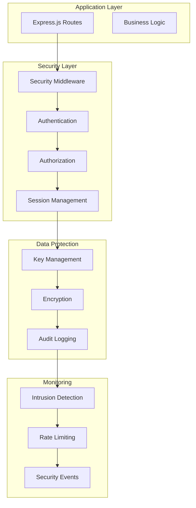

# Security Infrastructure Guide

## Overview

The Gamma Adaptive System includes a comprehensive security infrastructure designed to protect sensitive trading data, manage user authentication and authorization, and ensure secure operations. The system implements enterprise-grade security measures including secure key management, JWT authentication with role-based access control, session management with automatic timeout, and comprehensive security monitoring.

## Architecture

### Core Security Components

1. **SecureKeyManager**: Encrypted storage and management of API keys and secrets
2. **JWTAuthManager**: JWT-based authentication with role-based access control
3. **SessionManager**: Secure session handling with automatic cleanup
4. **SecurityManager**: Unified security orchestration and monitoring

### Security Layers



## Quick Start

### Basic Security Setup

```typescript
import { SecurityManager, createSecurityManager } from './gamma-services/security';

// Create security manager with production preset
const securityManager = createSecurityManager('PRODUCTION');
await securityManager.initialize();

// Authenticate user
const result = await securityManager.authenticateUser(
  'username',
  'password',
  '192.168.1.1',
  'Mozilla/5.0...'
);

if (result.success) {
  console.log('Authentication successful:', result.tokens);
}
```

### Express.js Integration

```typescript
import express from 'express';
import { createSecurityMiddleware } from './gamma-services/security';

const app = express();
const security = createSecurityMiddleware(securityManager);

// Apply security middleware
app.use(security.securityHeaders);
app.use(security.cors);
app.use(security.rateLimiter);
app.use(security.authenticate);

// Protected routes
app.get('/api/portfolio', security.requireAuth, (req, res) => {
  res.json({ portfolio: req.user.portfolio });
});
```

## Secure Key Management

### Features

- **Encrypted Storage**: All keys are encrypted at rest using AES-256-GCM
- **Automatic Rotation**: Configurable key rotation with backup retention
- **Environment Integration**: Seamless integration with environment variables
- **Export/Import**: Secure backup and recovery capabilities
- **Audit Trail**: Complete key usage tracking

### Usage

```typescript
import { EnvironmentKeyManager } from './gamma-services/security';

const keyManager = EnvironmentKeyManager.getInstance();
await keyManager.initialize();

// Store API key
await keyManager.storeApiKey('polygon', 'your-api-key', {
  expiresIn: 30 * 24 * 60 * 60 * 1000, // 30 days
  autoRotate: true
});

// Retrieve API key
const apiKey = await keyManager.getApiKey('polygon');
```

### Configuration

```typescript
interface KeyConfig {
  keyStorePath: string;           // Path to encrypted key store
  rotationInterval: number;       // Automatic rotation interval (ms)
  backupCount: number;           // Number of backups to retain
  compressionEnabled: boolean;    // Enable compression for storage
}
```

## JWT Authentication

### Features

- **Role-Based Access Control (RBAC)**: Hierarchical role and permission system
- **Token Refresh**: Secure token refresh mechanism
- **Token Revocation**: Immediate token invalidation
- **Multi-Device Support**: Manage multiple sessions per user
- **Configurable Expiry**: Separate access and refresh token lifetimes

### User Roles and Permissions

```typescript
// Predefined roles
export const ROLES = {
  ADMIN: 'admin',
  TRADER: 'trader',
  ANALYST: 'analyst',
  VIEWER: 'viewer',
  USER: 'user'
};

// Granular permissions
export const PERMISSIONS = {
  EXECUTE_TRADES: 'execute_trades',
  VIEW_POSITIONS: 'view_positions',
  MANAGE_PORTFOLIO: 'manage_portfolio',
  MANAGE_USERS: 'manage_users',
  VIEW_SYSTEM_METRICS: 'view_system_metrics',
  SYSTEM_ADMIN: 'system_admin'
};
```

### Usage

```typescript
import { JWTAuthManager, ROLES, PERMISSIONS } from './gamma-services/security';

// Create user
const user = await authManager.createUser({
  username: 'trader1',
  email: 'trader@example.com',
  password: 'SecurePassword123!',
  roles: [ROLES.TRADER],
  permissions: [PERMISSIONS.EXECUTE_TRADES, PERMISSIONS.VIEW_POSITIONS]
});

// Generate tokens
const tokens = await authManager.generateTokens(user);

// Verify token
const payload = await authManager.verifyToken(tokens.accessToken);
```

### Token Structure

```typescript
interface TokenPayload {
  sub: string;           // User ID
  username: string;      // Username
  email: string;         // Email address
  roles: string[];       // User roles
  permissions: string[]; // User permissions
  iat: number;          // Issued at
  exp: number;          // Expires at
  iss: string;          // Issuer
  aud: string;          // Audience
  jti: string;          // JWT ID
}
```

## Session Management

### Features

- **Automatic Timeout**: Configurable session expiration
- **Security Headers**: Comprehensive HTTP security headers
- **Session Validation**: IP and user agent validation
- **Concurrent Sessions**: Configurable maximum sessions per user
- **Suspicious Activity Detection**: Automatic threat detection

### Security Headers

The system automatically applies comprehensive security headers:

```typescript
{
  'X-Content-Type-Options': 'nosniff',
  'X-Frame-Options': 'DENY',
  'X-XSS-Protection': '1; mode=block',
  'Strict-Transport-Security': 'max-age=31536000; includeSubDomains; preload',
  'Content-Security-Policy': 'default-src \'self\'; script-src \'self\' \'unsafe-inline\'...',
  'Referrer-Policy': 'strict-origin-when-cross-origin',
  'Permissions-Policy': 'camera=(), microphone=(), geolocation=()...'
}
```

### Session Configuration

```typescript
interface SessionConfig {
  sessionTimeout: number;         // Session timeout (ms)
  maxSessions: number;           // Max sessions per user
  secureHeaders: boolean;        // Enable security headers
  sameSite: 'strict' | 'lax' | 'none'; // Cookie SameSite policy
  httpOnly: boolean;             // HttpOnly cookie flag
  secure: boolean;               // Secure cookie flag
  cookieName: string;            // Session cookie name
  cleanupInterval: number;       // Cleanup interval (ms)
}
```

## Security Monitoring

### Features

- **Intrusion Detection**: Automatic detection of suspicious patterns
- **Rate Limiting**: Configurable request rate limiting
- **Audit Logging**: Comprehensive security event logging
- **Real-time Metrics**: Live security metrics and statistics
- **Alert System**: Configurable security alerts

### Security Events

The system tracks various security events:

```typescript
type SecurityEventType = 
  | 'AUTH_SUCCESS'
  | 'AUTH_FAILURE'
  | 'SESSION_CREATED'
  | 'SESSION_DESTROYED'
  | 'PERMISSION_DENIED'
  | 'SUSPICIOUS_ACTIVITY'
  | 'RATE_LIMIT_EXCEEDED'
  | 'INTRUSION_DETECTED'
  | 'PASSWORD_CHANGED'
  | 'ACCOUNT_LOCKED';
```

### Monitoring Setup

```typescript
securityManager.on('securityEvent', (event) => {
  console.log(`Security Event [${event.severity}]: ${event.type}`);
  
  if (event.severity === 'CRITICAL') {
    // Send alert to monitoring system
    alertingSystem.sendAlert(event);
  }
});

securityManager.on('criticalSecurityEvent', (event) => {
  // Immediate response to critical events
  emergencyResponse.handle(event);
});
```

## Password Policy

### Default Policy

```typescript
interface PasswordPolicy {
  minLength: number;              // Minimum password length
  requireUppercase: boolean;      // Require uppercase letters
  requireLowercase: boolean;      // Require lowercase letters
  requireNumbers: boolean;        // Require numeric characters
  requireSpecialChars: boolean;   // Require special characters
  maxAge: number;                // Maximum password age (days)
  preventReuse: number;          // Prevent reuse of N previous passwords
}
```

### Validation

```typescript
// Validate password against policy
const isValid = securityManager.validatePassword('MySecurePassword123!');

// Password strength requirements:
// - Minimum 8 characters (configurable)
// - At least one uppercase letter
// - At least one lowercase letter
// - At least one number
// - At least one special character
```

## Rate Limiting

### Configuration

```typescript
interface RateLimitingConfig {
  enabled: boolean;              // Enable rate limiting
  windowMs: number;              // Time window (ms)
  maxRequests: number;           // Max requests per window
  skipSuccessfulRequests: boolean; // Skip successful requests
}
```

### Implementation

```typescript
// Create rate limiter
const rateLimiter = securityManager.createRateLimiter();

// Apply to Express.js
app.use(rateLimiter);

// Custom rate limiting for specific endpoints
app.use('/api/auth', rateLimit({
  windowMs: 15 * 60 * 1000, // 15 minutes
  max: 5, // 5 attempts per window
  message: 'Too many authentication attempts'
}));
```

## Data Encryption

### Features

- **At-Rest Encryption**: All sensitive data encrypted in storage
- **In-Transit Encryption**: TLS encryption for all communications
- **Key Derivation**: PBKDF2 with configurable iterations
- **Secure Random Generation**: Cryptographically secure random values

### Usage

```typescript
// Encrypt sensitive data
const encryptedData = await securityManager.encryptSensitiveData('sensitive-info');

// Decrypt sensitive data
const decryptedData = await securityManager.decryptSensitiveData(encryptedData);

// Generate secure random values
const randomString = SecurityUtils.generateSecureRandom(32);
const nonce = SecurityUtils.generateCSPNonce();
```

## Configuration Presets

### Development Preset

```typescript
const devSecurity = createSecurityManager('DEVELOPMENT', {
  // Relaxed security for development
  security: {
    encryptionEnabled: false,
    intrusionDetection: false,
    passwordPolicy: {
      minLength: 6,
      requireSpecialChars: false
    }
  }
});
```

### Staging Preset

```typescript
const stagingSecurity = createSecurityManager('STAGING', {
  // Balanced security for staging
  rateLimiting: {
    enabled: true,
    maxRequests: 200
  },
  security: {
    passwordPolicy: {
      minLength: 8,
      requireSpecialChars: false
    }
  }
});
```

### Production Preset

```typescript
const prodSecurity = createSecurityManager('PRODUCTION', {
  // Maximum security for production
  session: {
    sessionTimeout: 30 * 60 * 1000, // 30 minutes
    maxSessions: 3
  },
  security: {
    passwordPolicy: {
      minLength: 12,
      requireSpecialChars: true,
      maxAge: 90,
      preventReuse: 10
    }
  }
});
```

## Middleware Integration

### Authentication Middleware

```typescript
// Require authentication
app.use('/api/protected', security.requireAuth);

// Require specific role
app.use('/api/admin', security.requireRole('admin'));

// Require specific permission
app.use('/api/trades', security.requirePermission('execute_trades'));

// Multiple requirements
app.use('/api/sensitive', 
  security.requireAuth,
  security.requireRole('trader'),
  security.requirePermission('manage_portfolio')
);
```

### Security Headers Middleware

```typescript
// Apply security headers to all routes
app.use(security.securityHeaders);

// Custom CSP for specific routes
app.use('/api/upload', (req, res, next) => {
  res.setHeader('Content-Security-Policy', 
    "default-src 'self'; img-src 'self' data:; script-src 'none'");
  next();
});
```

## API Reference

### SecurityManager

```typescript
class SecurityManager {
  async initialize(): Promise<void>
  async authenticateUser(username: string, password: string, ipAddress: string, userAgent: string): Promise<AuthResult>
  async createUser(userData: UserData): Promise<CreateUserResult>
  async validateToken(token: string): Promise<TokenPayload | null>
  async refreshTokens(refreshToken: string): Promise<AuthTokens | null>
  async revokeToken(tokenId: string): Promise<boolean>
  async getSecurityMetrics(): Promise<SecurityMetrics>
  async getSecurityEvents(limit?: number, severity?: string, type?: string): Promise<SecurityEvent[]>
  validatePassword(password: string): boolean
  createRateLimiter(): RateLimitMiddleware
  async shutdown(): Promise<void>
}
```

### SecureKeyManager

```typescript
class SecureKeyManager {
  async initialize(): Promise<void>
  async storeKey(name: string, value: string, options?: KeyOptions): Promise<string>
  async getKey(keyId: string): Promise<string | null>
  async getKeyByName(name: string): Promise<string | null>
  async deleteKey(keyId: string): Promise<boolean>
  async rotateKey(keyId: string, newValue: string): Promise<KeyRotationInfo>
  async listKeys(): Promise<KeyInfo[]>
  async exportKeys(password: string): Promise<string>
  async importKeys(encryptedData: string, password: string): Promise<number>
  async cleanup(): Promise<number>
  getStats(): KeyStats
  async shutdown(): Promise<void>
}
```

### SessionManager

```typescript
class SessionManager {
  async initialize(): Promise<void>
  async createSession(userId: string, username: string, roles: string[], permissions: string[], ipAddress: string, userAgent: string): Promise<Session>
  async getSession(sessionId: string): Promise<Session | null>
  async refreshSession(sessionId: string): Promise<boolean>
  async destroySession(sessionId: string): Promise<boolean>
  async destroyAllUserSessions(userId: string): Promise<number>
  async validateSession(sessionId: string, ipAddress: string, userAgent: string): Promise<Session | null>
  getUserSessions(userId: string): Session[]
  getActiveSessions(): Session[]
  getSessionStats(): SessionStats
  generateSecurityHeaders(): SecurityHeaders
  generateSessionCookie(sessionId: string): string
  clearSessionCookie(): string
  async shutdown(): Promise<void>
}
```

## Environment Variables

### Required Variables

```bash
# JWT Configuration
JWT_SECRET=your-jwt-secret-key-here
JWT_ISSUER=gamma-adaptive-system
JWT_AUDIENCE=gamma-adaptive-users

# Session Configuration
SESSION_TIMEOUT=1800000  # 30 minutes
MAX_SESSIONS_PER_USER=5
SESSION_COOKIE_NAME=gamma_session

# Key Management
KEY_STORE_PATH=./keys/secure-keys.json
KEY_ROTATION_INTERVAL=86400000  # 24 hours
MASTER_ENCRYPTION_KEY=your-master-key-here

# Rate Limiting
RATE_LIMITING_ENABLED=true
RATE_LIMIT_WINDOW=900000  # 15 minutes
RATE_LIMIT_MAX=100

# Security Features
ENCRYPTION_ENABLED=true
AUDIT_LOGGING=true
INTRUSION_DETECTION=true
STRICT_IP_VALIDATION=false
STRICT_UA_VALIDATION=false

# Password Policy
PASSWORD_MIN_LENGTH=8
PASSWORD_REQUIRE_UPPERCASE=true
PASSWORD_REQUIRE_LOWERCASE=true
PASSWORD_REQUIRE_NUMBERS=true
PASSWORD_REQUIRE_SPECIAL=true
PASSWORD_MAX_AGE=90
PASSWORD_PREVENT_REUSE=5
```

### API Keys

```bash
# Trading API Keys (stored securely)
POLYGON_API_KEY=your-polygon-api-key
TRADIER_ACCESS_TOKEN=your-tradier-token
TWELVEDATA_API_KEY=your-twelvedata-key
CBOE_API_KEY=your-cboe-key
```

## Best Practices

### Security Implementation

1. **Use HTTPS**: Always use HTTPS in production
2. **Secure Headers**: Apply comprehensive security headers
3. **Input Validation**: Validate and sanitize all user input
4. **Rate Limiting**: Implement appropriate rate limiting
5. **Audit Logging**: Log all security-relevant events
6. **Regular Updates**: Keep dependencies updated
7. **Principle of Least Privilege**: Grant minimum necessary permissions

### Password Security

1. **Strong Policies**: Enforce strong password requirements
2. **Secure Storage**: Use proper password hashing (PBKDF2, bcrypt, Argon2)
3. **Regular Rotation**: Encourage regular password changes
4. **Breach Detection**: Monitor for compromised passwords
5. **Multi-Factor Authentication**: Consider implementing MFA

### Session Management

1. **Secure Cookies**: Use HttpOnly, Secure, and SameSite flags
2. **Session Timeout**: Implement appropriate timeout values
3. **Session Validation**: Validate sessions on each request
4. **Concurrent Sessions**: Limit concurrent sessions per user
5. **Logout Functionality**: Provide secure logout

### Key Management

1. **Encryption at Rest**: Encrypt all stored keys
2. **Regular Rotation**: Implement automatic key rotation
3. **Secure Generation**: Use cryptographically secure random generation
4. **Access Control**: Restrict key access to authorized processes
5. **Backup and Recovery**: Maintain secure backups

## Troubleshooting

### Common Issues

#### Authentication Failures
- **Cause**: Invalid credentials, expired tokens, account lockout
- **Solution**: Check user credentials, token expiry, account status
- **Prevention**: Implement proper error handling, user feedback

#### Session Issues
- **Cause**: Session timeout, invalid session ID, IP validation
- **Solution**: Check session configuration, validate session data
- **Prevention**: Implement proper session management, user notifications

#### Rate Limiting
- **Cause**: Too many requests, incorrect configuration
- **Solution**: Adjust rate limits, implement exponential backoff
- **Prevention**: Monitor usage patterns, set appropriate limits

#### Key Management
- **Cause**: Encryption errors, key rotation failures, storage issues
- **Solution**: Check encryption configuration, verify key storage
- **Prevention**: Regular key rotation testing, backup verification

### Debugging

```bash
# Enable debug logging
DEBUG=security:* npm start

# Check security events
curl http://localhost:3000/api/security/events

# Validate token
curl -H "Authorization: Bearer <token>" http://localhost:3000/api/auth/validate

# Check session status
curl -H "Cookie: gamma_session=<session-id>" http://localhost:3000/api/auth/session
```

### Monitoring Queries

```bash
# Authentication success rate
sum(rate(auth_success_total[5m])) / sum(rate(auth_attempts_total[5m]))

# Active sessions
gauge(active_sessions_total)

# Security events by severity
sum by (severity) (rate(security_events_total[5m]))

# Rate limit violations
sum(rate(rate_limit_exceeded_total[5m]))
```

## Security Compliance

### Standards Compliance

- **OWASP Top 10**: Protection against common web vulnerabilities
- **NIST Cybersecurity Framework**: Comprehensive security controls
- **ISO 27001**: Information security management standards
- **SOC 2**: Security, availability, and confidentiality controls

### Audit Requirements

- **Access Logging**: Complete audit trail of access attempts
- **Data Protection**: Encryption of sensitive data at rest and in transit
- **User Management**: Proper user lifecycle management
- **Incident Response**: Security incident detection and response

This comprehensive security infrastructure provides enterprise-grade protection for the Gamma Adaptive System, ensuring secure operations while maintaining usability and performance.